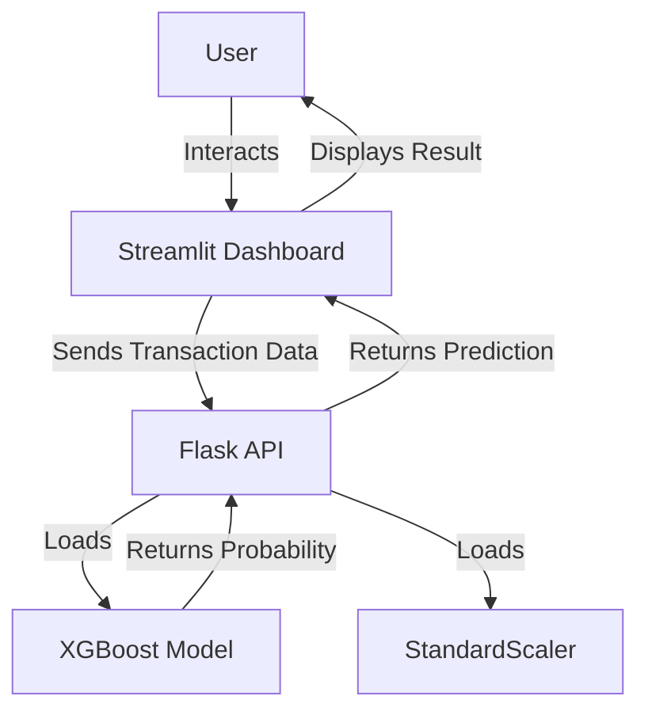

# 💳 AI-Based Financial Fraud Detection System - Project Report

## 1. Project Overview
This project is an AI-powered system designed to detect fraudulent financial transactions using machine learning. It utilizes a dataset of credit card transactions to train models that can classify transactions as legitimate or fraudulent in real-time. The system exposes a Flask API for predictions and includes an interactive Streamlit dashboard for user interaction.

## 2. Architecture
The system follows a microservices-like architecture, containerized using Docker.



### Components
1.  **Data Processing Pipeline**:
    *   **Input**: Raw CSV data (`creditcard.csv`).
    *   **Preprocessing**: Log transformation of 'Amount', extraction of 'hour' from 'Time'.
    *   **Balancing**: SMOTE (Synthetic Minority Over-sampling Technique) to handle class imbalance.
    *   **Scaling**: StandardScaler to normalize features.
    *   **Output**: Processed NumPy arrays (`processed_data.npz`) and saved Scaler (`scaler.joblib`).

2.  **Machine Learning Models**:
    *   **Random Forest**: A robust ensemble method used for baseline performance.
    *   **XGBoost**: A high-performance gradient boosting model used for the final production API due to its superior accuracy and speed.
    *   **Training**: Models are trained on balanced data and evaluated using ROC-AUC scores.

3.  **Backend API (Flask)**:
    *   **Endpoint**: `/predict` (POST).
    *   **Functionality**: Accepts JSON input, scales features, runs inference, and returns fraud probability.
    *   **Security**: Basic input validation.

4.  **Frontend Dashboard (Streamlit)**:
    *   **Interface**: User-friendly form to input transaction details.
    *   **Visualization**: Real-time feedback on fraud probability.

## 3. Technology Stack
*   **Language**: Python 3.9+
*   **Web Frameworks**: Flask (API), Streamlit (UI)
*   **Machine Learning**: Scikit-learn, XGBoost, Imbalanced-learn (SMOTE)
*   **Data Manipulation**: Pandas, NumPy
*   **Containerization**: Docker, Docker Compose
*   **CI/CD**: GitHub Actions
*   **Testing**: Pytest

## 4. Folder Structure
```
├── .github/workflows/   # CI/CD Pipeline configuration
├── data/                # Dataset storage (ignored in git)
├── models/              # Trained models and scalers (ignored in git)
├── notebooks/           # Jupyter notebooks for EDA and experiments
├── src/                 # Source code
│   ├── api.py           # Flask API implementation
│   ├── preprocess.py    # Data preprocessing script
│   ├── train_models.py  # Model training script
│   └── __init__.py      # Package initialization
├── tests/               # Unit and integration tests
├── Dockerfile.api       # Docker build for API
├── Dockerfile.streamlit # Docker build for Dashboard
├── docker-compose.yml   # Container orchestration
├── requirements.txt     # Python dependencies
└── README.md            # Quick start guide
```

## 5. Key Features
*   **Real-time Prediction**: Instant fraud detection for new transactions.
*   **Data Balancing**: Handles the highly imbalanced nature of fraud datasets effectively.
*   **Scalable Architecture**: Dockerized services allow for easy deployment and scaling.
*   **Automated Testing**: CI pipeline ensures code quality and reliability.
*   **Interactive UI**: Simple interface for non-technical users to test the model.

## 6. Future Improvements
To make this project even more advanced, the following enhancements are recommended:

### A. MLOps & Monitoring
*   **Model Registry**: Use **MLflow** to track experiments, model versions, and parameters.
*   **Drift Detection**: Implement tools like **Evidently AI** to detect data drift (when production data diverges from training data).
*   **Performance Monitoring**: Use **Prometheus** and **Grafana** to monitor API latency and error rates.

### B. Advanced Modeling
*   **Deep Learning**: Implement Autoencoders or LSTMs (Long Short-Term Memory) for anomaly detection to capture complex temporal patterns.
*   **Ensemble Methods**: Combine predictions from XGBoost, Random Forest, and Neural Networks for higher accuracy.
*   **Explainability**: Integrate **SHAP** (SHapley Additive exPlanations) values directly into the Streamlit dashboard to explain *why* a transaction was flagged.

### C. Infrastructure & Security
*   **Database**: Replace in-memory processing with a database (e.g., **PostgreSQL**) to store transaction history and predictions.
*   **Authentication**: Add user login to the Streamlit app and secure the API with **API Keys** or **JWT** (JSON Web Tokens).
*   **Cloud Deployment**: Deploy the Docker containers to a cloud provider like **AWS ECS**, **Google Cloud Run**, or **Azure Container Apps**.

### D. Real-time Data Engineering
*   **Streaming**: Use **Apache Kafka** or **RabbitMQ** to ingest and process transactions in real-time streams instead of batch REST API calls.
